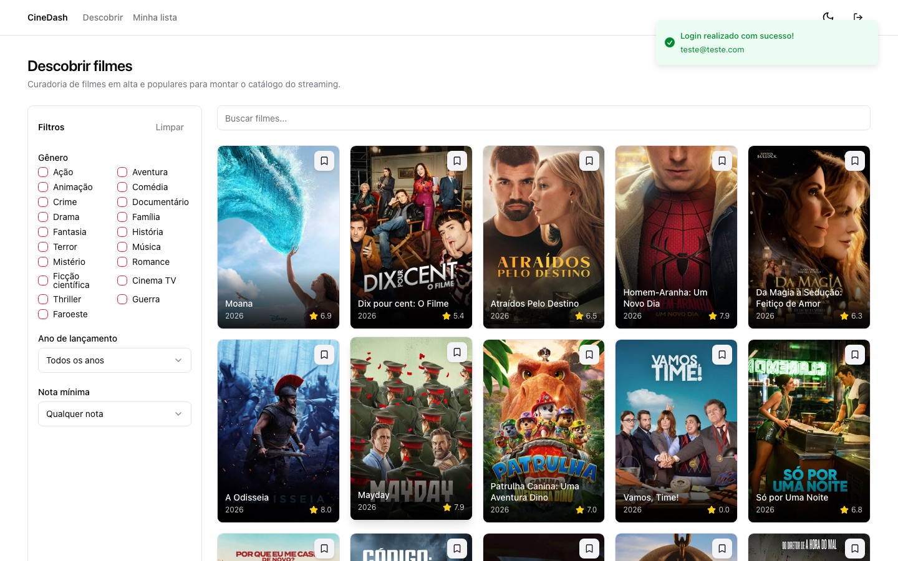
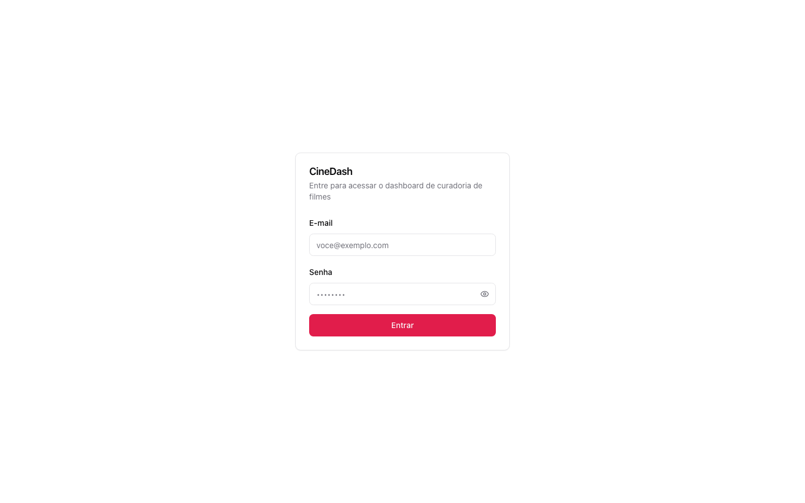
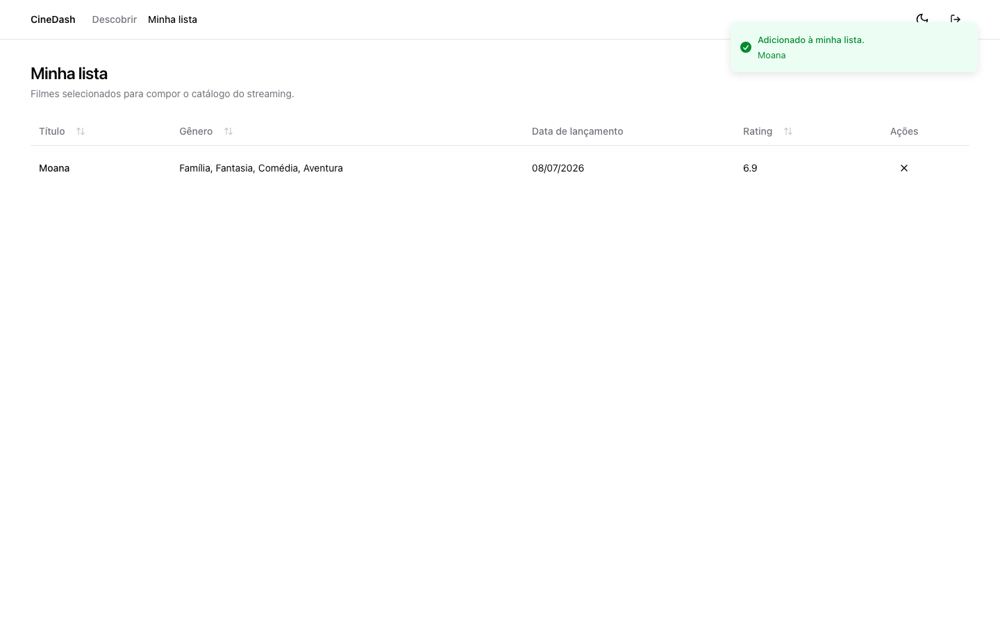
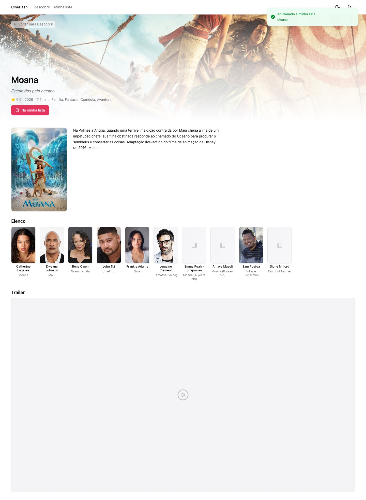
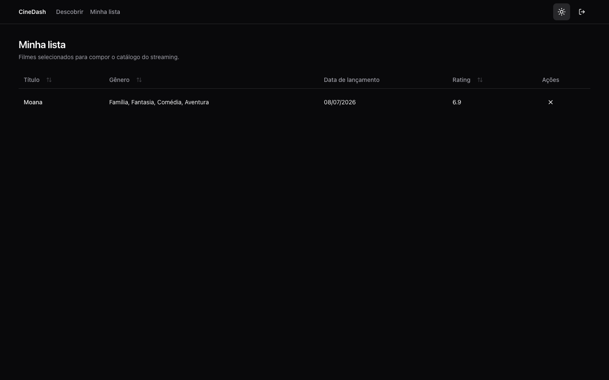

<a id="readme-top"></a>

<div align="center">

# 🎬 CineDash

Dashboard de curadoria e descoberta de filmes.

[](https://github.com/YagoMilitao/react-frontend-challenge/actions/workflows/ci.yml)


[Ver demo](https://cinedash-five.vercel.app) · [Reportar bug](https://github.com/YagoMilitao/react-frontend-challenge/issues) · [Documentação de arquitetura](./ARCHITECTURE.md)

</div>



<details>
  <summary>Sumário</summary>
  <ol>
    <li><a href="#sobre-o-projeto">Sobre o projeto</a></li>
    <li><a href="#stack">Stack</a></li>
    <li><a href="#screenshots">Screenshots</a></li>
    <li><a href="#como-rodar">Como rodar</a></li>
    <li><a href="#testes">Testes</a></li>
    <li><a href="#arquitetura">Arquitetura</a></li>
    <li><a href="#deploy">Deploy</a></li>
    <li><a href="#roadmap">Roadmap / pendências</a></li>
    <li><a href="#contato">Contato</a></li>
    <li><a href="#agradecimentos">Agradecimentos</a></li>
  </ol>
</details>

## Sobre o projeto

**CineDash** é um dashboard interno fictício para curadores de um serviço de streaming: buscar, filtrar e descobrir filmes (via API do TMDB), montar uma watchlist pessoal e ver detalhes completos — elenco, sinopse e trailer — antes de decidir o que entra no catálogo.

**Funcionalidades:**

- 🔐 Autenticação simulada (Zod + sessão persistida)
- 🔎 Busca com debounce, filtros por gênero/ano/nota e paginação
- ⭐ Watchlist persistida, com tabela ordenável (TanStack Table)
- 🎞️ Página de detalhes com elenco, sinopse e trailer
- 🌗 Tema claro/escuro persistido
- 🔔 Feedback visual completo: skeletons, estados de erro e toasts

<p align="right">(<a href="#readme-top">voltar ao topo</a>)</p>

## Stack

| Camada | Tecnologia |
|---|---|
| Core | React 18 · TypeScript (strict) · Vite |
| Server state | TanStack Query (cache, prefetch, retry) |
| Client state | Zustand (com `persist` seletivo) |
| Roteamento | TanStack Router |
| UI | Shadcn/ui (Radix) + TailwindCSS |
| Formulários | React Hook Form + Zod |
| Listagem complexa | TanStack Table |
| Testes | Vitest + React Testing Library |

Nenhuma alternativa à stack obrigatória foi usada — ver justificativas de cada decisão em [ARCHITECTURE.md](./ARCHITECTURE.md).

<p align="right">(<a href="#readme-top">voltar ao topo</a>)</p>

## Screenshots

<table>
  <tr>
    <td><p align="center"><sub>Login</sub></p></td>
    <td><p align="center"><sub>Minha lista</sub></p></td>
  </tr>
  <tr>
    <td colspan="2"><p align="center"><sub>Detalhes do filme (banner com imagem de fundo, elenco e trailer)</sub></p></td>
  </tr>
  <tr>
    <td colspan="2"><p align="center"><sub>Tema escuro</sub></p></td>
  </tr>
</table>

<p align="right">(<a href="#readme-top">voltar ao topo</a>)</p>

## Como rodar

```bash
git clone https://github.com/YagoMilitao/react-frontend-challenge.git
cd react-frontend-challenge
npm install
cp .env.example .env   # preencha VITE_TMDB_API_READ_TOKEN
npm run dev
```

Login: qualquer e-mail válido + senha com 6+ caracteres (não há backend real).

Passo a passo completo (obtenção do token do TMDB, todos os comandos disponíveis, o que foi implementado) em **[INSTRUCTIONS.md](./INSTRUCTIONS.md)**.

<p align="right">(<a href="#readme-top">voltar ao topo</a>)</p>

## Testes

```bash
npm test              # suíte completa (Vitest + RTL)
npm run test:coverage # com relatório de cobertura
npm run lint           # ESLint
```

108 testes cobrindo hooks de dados, stores, componentes e os fluxos de integração principais (busca → filtro → paginação; adicionar/remover da watchlist; navegação para detalhes). Roda automaticamente em CI a cada push/PR — veja o badge no topo.

<p align="right">(<a href="#readme-top">voltar ao topo</a>)</p>

## Arquitetura

Organizado em [Feature-Sliced Design](https://feature-sliced.design) (`app → pages → widgets → features → entities → shared`), com TanStack Query cuidando de todo estado vindo da API (cache keys estruturadas, prefetch no hover dos cards, `keepPreviousData` na paginação) e Zustand só para estado de cliente (sessão, watchlist, tema, filtros — cada um com uma decisão explícita de persistir ou não).

Decisões detalhadas, desafios reais encontrados com a API do TMDB e o que seria feito diferente com mais tempo: **[ARCHITECTURE.md](./ARCHITECTURE.md)**.

<p align="right">(<a href="#readme-top">voltar ao topo</a>)</p>

## Deploy

**🔗 Live: [cinedash-five.vercel.app](https://cinedash-five.vercel.app)** — hospedado na Vercel, com deploy automático a cada push em `main` (Git integration nativa da Vercel).

O projeto é uma SPA (Vite + TanStack Router). Qualquer host estático serve, mas **é necessário configurar um rewrite para `index.html`**, senão recarregar a página em uma rota interna (ex.: `/watchlist`) resulta em 404 do próprio host.

<details>
<summary>Vercel</summary>

```json
// vercel.json
{
  "rewrites": [
    { "source": "/api/tmdb/:path*", "destination": "/api/tmdb?path=:path*" },
    { "source": "/((?!api/).*)", "destination": "/index.html" }
  ]
}
```

A primeira regra alimenta o proxy de API (`api/tmdb.ts`, ver abaixo); a segunda é o rewrite de SPA, com um lookahead negativo para não interceptar `/api/*`.

Deploy feito via Vercel CLI (`npx vercel`), com o repositório GitHub conectado ao projeto na Vercel para que pushes subsequentes gerem deploy automaticamente (preview em branches/PRs, produção em `main`).
</details>

<details>
<summary>Netlify</summary>

```
# public/_redirects
/*  /index.html  200
```
</details>

O token do TMDB **não** é enviado ao navegador: `api/tmdb.ts` é uma serverless function (Vercel Edge) que injeta o Bearer token e faz proxy das chamadas — o client só conhece `/api/tmdb/...`, same-origin, sem credencial nenhuma. Configure `TMDB_API_READ_TOKEN` (sem prefixo `VITE_`, propositalmente) nas variáveis de ambiente do host, em Production **e** Preview.

<p align="right">(<a href="#readme-top">voltar ao topo</a>)</p>

## Roadmap / pendências

- [ ] Code-splitting por rota (`React.lazy`) — bundle atual passa do aviso de 500kb do Vite
- [ ] Testes de acessibilidade automatizados (axe)
- [ ] E2E formal (Playwright) cobrindo o fluxo crítico ponta a ponta

Lista completa e o porquê de cada item em [INSTRUCTIONS.md](./INSTRUCTIONS.md#o-que-ficou-de-fora--próximos-passos).

<p align="right">(<a href="#readme-top">voltar ao topo</a>)</p>

## Contato

Yago Militão — [github.com/YagoMilitao](https://github.com/YagoMilitao)

Link do projeto: [github.com/YagoMilitao/react-frontend-challenge](https://github.com/YagoMilitao/react-frontend-challenge)

<p align="right">(<a href="#readme-top">voltar ao topo</a>)</p>

## Agradecimentos

- Dados de filmes fornecidos pela [API do TMDB](https://www.themoviedb.org/) — este produto usa a API do TMDB, mas não é endossado ou certificado pelo TMDB.
- Componentes de UI baseados em [shadcn/ui](https://ui.shadcn.com/) e [Radix UI](https://www.radix-ui.com/).
- Ícones por [Lucide](https://lucide.dev/).
- Estrutura deste README inspirada no [Best-README-Template](https://github.com/othneildrew/Best-README-Template).

<p align="right">(<a href="#readme-top">voltar ao topo</a>)</p>
